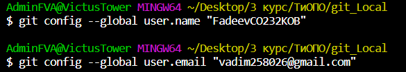
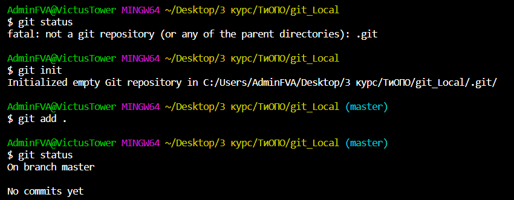
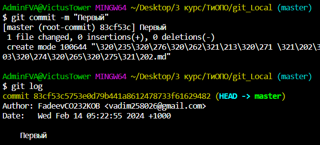
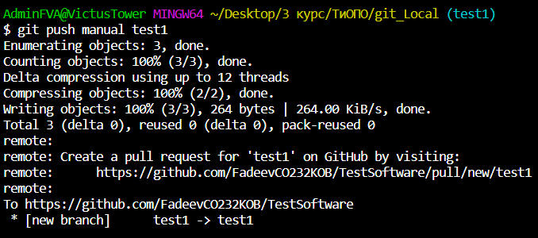

# **Инструкция по работе с Git в VS Code**

## Подготовка рабочего места
Установите Visual Studio Code и Git Bash, а так же пройдите регистрацию на GitHub для того,чтобы приступить к работе.

В начале работы создаёте папку. 
Далее, запустите Visual Studio Code, зажмите сочетание клавиш "ctrl + shift + p". В появившемся диалоговом окне нажимаете на "Terminal: Select Default Profile" и выбираете пункт "Git Bash".

В первую очередь, необходимо войти в аккаунт при помощи следующих команд:
* git config --global user.name "имя_пользователя" - задаём имя пользователя для коммитов.
* git config --global user.email "адрес_электронной_почты" - задаём email для коммитов.

* git version - эта команда покажет версию Git, которая установлена.
## Инициализация репозитория
Чтобы инициализировать наш репозиторий и посмотреть его статус, в терминале вводим команды:
* git init - инициализация репозитория.
* git status - отображает состояние директории, на данный момент нам показывает, что ни один файл мало того не отслеживается Git, но и не создан вовсе.

* git add . - добавляет все файлы в репозиторий.
* git add <filename> - добавить файл в репозиторий.

## Работа с коммитами
Давайте теперь наглядно посмотрим, как через терминал занести изменения(коммиты) на Git.
* git commit -m "text" - записывает изменения в репозиторий.
* git log - отображает историю коммитов с изменениями.

Команды,которые еще доступны при работе с коммитами:
* git log --graph - отображает дерево зависимостей для всех коммитов.
* git log --oneline - отображает коммиты в одну строку (только хэш и сообщение).
* git log --oneline --stat - отображает статистику изменённых файлов для каждого коммита, при этом в одну строку.
* git diff - отображает разницу между любыми двумя Git деревьями (коммиты, например).
* git commit -a -m "text" - записывает изменения в репозиторий и автоматически добавляет все измененные файлы в индекс.
* git commit --amend -m "text" - записывает изменения последнего коммита.

## Работа с удаленным репозиторием

* git remote add <название> <ссылка_репозитория> - добавляет удалённый репозиторий и присваивает ему имя.
* git push <название> <имя_ветки> - отправляет изменения (имя ветки) на сервер.
Для наглядности:

## Ветки в Git
Ну на этом этапе все просто.
* git branch <имя_ветки> - создаёт новую ветку.
* git checkout <имя_ветки> - переходит на заданную ветку.
* git merge <имя_ветки> - слияет указанную ветку с основной.
git checkout mywork
